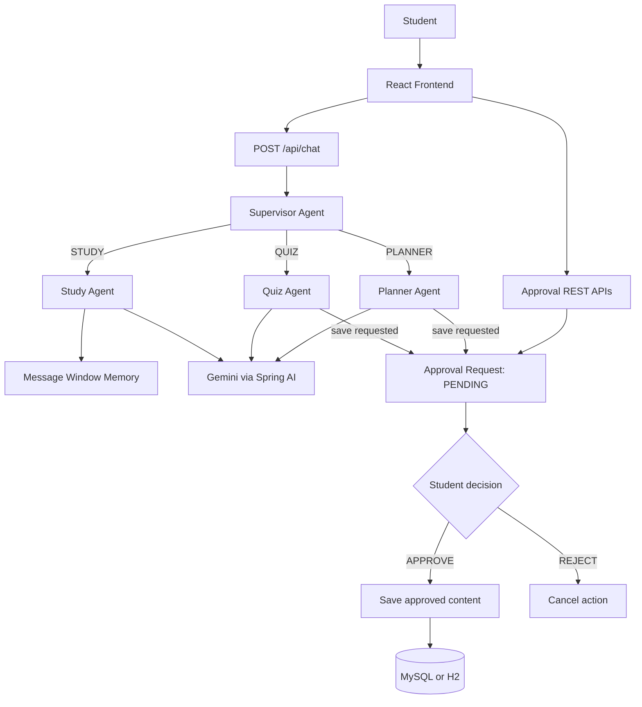

# AI Student Study Assistant

A beginner-friendly AI learning application built as one Spring Boot application with a React frontend. Students can ask for explanations, generate quizzes, create study plans, and approve or reject AI-proposed save actions.

The project demonstrates three useful ideas without microservices or workflow frameworks:

1. A supervisor routes a request to a focused agent.
2. Spring AI sends agent prompts to Gemini.
3. Human approval is required before important state changes are saved.

## Features

- Study Agent for simple explanations and examples
- Quiz Agent for practice questions
- Planner Agent for day-by-day study plans
- Supervisor routing for `STUDY`, `QUIZ`, and `PLANNER`
- Gemini integration through Spring AI `ChatClient`
- Conversation memory using `MessageWindowChatMemory`
- Human-in-the-loop approval for saving plans and quizzes
- JPA persistence with MySQL support
- H2 fallback for local development
- React/Vite chat interface with pending approvals
- Tests for routing, controllers, invalid actions, and double approval

## Architecture



## Request Flow

### Normal question

```text
Student -> ChatController -> ChatService -> SupervisorAgent
                -> StudyAgent -> Gemini -> ChatResponse
```

Normal explanations do not require approval.

### Save request

```text
Student asks to save
                -> Agent generates content
                -> ApprovalRequest is stored as PENDING
                -> Frontend displays Approve / Reject
                -> APPROVE saves to the database
                -> REJECT changes status without saving
```

The approval service checks that an action is still `PENDING`. An already approved or rejected request cannot be processed again.

## Agents

### Supervisor Agent

`SupervisorAgent` categorizes the request using clear Java rules:

- Words such as `quiz`, `question`, or `test` route to `QuizAgent`.
- Words such as `plan`, `schedule`, or `study for` route to `PlannerAgent`.
- Other learning questions route to `StudyAgent`.

This keeps routing easy to understand. A future version can ask Gemini for a structured `AgentDecision` instead.

### Study Agent

Explains a concept with a simple explanation, example, important points, and summary. It uses Spring AI conversation memory so a follow-up such as `What is its time complexity?` can refer to the previous topic.

### Quiz Agent

Creates multiple-choice practice content with four options, an answer, and an explanation. Saving the generated quiz requires approval.

### Planner Agent

Creates a day-by-day study plan with topics, tasks, time estimates, and practice recommendations. Saving the plan requires approval.

## Conversation Memory

The chat request accepts an optional `conversationId`:

```json
{
    "message": "What is its time complexity?",
    "conversationId": "browser-session-123"
}
```

The React client creates one ID per browser session. Spring AI keeps the latest 20 messages for each conversation ID in memory. This is intentionally simple: memory is lost when the backend restarts and is not a long-term student profile.

## Project Structure

```text
src/main/java/com/example/aistudyassistant/
    agent/          Supervisor, Study, Quiz, and Planner agents
    config/         Spring AI memory configuration
    controller/     Chat, approval, and saved-content REST controllers
    dto/            Request and response records
    entity/         JPA database entities
    repository/     Spring Data JPA repositories
    service/        Chat routing and approval business rules

frontend/
    src/main.jsx    React chat and approval interface
    src/style.css   Responsive visual design
```

## Technologies

- Java 17+ (the project has been verified with Java 23)
- Spring Boot 3.4.5
- Spring AI 1.1.8
- Maven
- Spring Web
- Spring Data JPA and Hibernate
- MySQL or H2
- React and Vite

## Configuration

Never commit API keys. Set the Gemini key in the terminal that starts Spring Boot.

```powershell
$env:GEMINI_API_KEY="your-new-key"
$env:DEMO_MODE="false"
```

The project reads the following variables:

| Variable | Default | Purpose |
| --- | --- | --- |
| `GEMINI_API_KEY` | empty | Gemini authentication |
| `GEMINI_MODEL` | `gemini-2.0-flash` | Gemini model name |
| `DEMO_MODE` | `false` | Use local sample answers instead of model calls |
| `DB_URL` | H2 in-memory URL | Database JDBC URL |
| `DB_USERNAME` | `sa` | Database username |
| `DB_PASSWORD` | empty | Database password |
| `FRONTEND_URL` | `http://localhost:5173` | Allowed browser origin |

Gemini configuration is intentionally external to [application.properties](src/main/resources/application.properties).

## MySQL Setup

Create the database once:

```sql
CREATE DATABASE ai_study_assistant;
```

Then configure the backend:

```powershell
$env:DB_URL="jdbc:mysql://localhost:3306/ai_study_assistant"
$env:DB_USERNAME="root"
$env:DB_PASSWORD="your-password"
```

Without these variables, H2 is used so the project can run without installing MySQL first.

## Run Locally

### Backend

From the project root:

```powershell
$env:GEMINI_API_KEY="your-new-key"
$env:DEMO_MODE="false"
mvn spring-boot:run
```

The backend runs at `http://localhost:8080`.

### Frontend

In a second terminal:

```powershell
cd frontend
npm install
npm run dev
```

Open `http://localhost:5173`.

## REST API

### Chat

```http
POST /api/chat
Content-Type: application/json

{
    "message": "Explain binary search",
    "conversationId": "student-session-1"
}
```

Normal response:

```json
{
    "type": "STUDY",
    "response": "...",
    "approvalId": null
}
```

Save request response:

```json
{
    "type": "APPROVAL_REQUIRED",
    "response": "I created the plan. Approval is required before saving it.",
    "approvalId": 1
}
```

### Approvals

```http
GET  /api/approvals/pending
POST /api/approvals/{id}/approve
POST /api/approvals/{id}/reject
```

### Saved content

```http
GET /api/saved/plans
GET /api/saved/quizzes
```

## Testing

Run backend tests:

```powershell
mvn test
```

The test suite covers supervisor routing, chat-controller conversation IDs, invalid actions, and protection against processing an approval twice.

Build the frontend:

```powershell
cd frontend
npm run build
```

## Security Notes

- API keys belong in environment variables, never source files.
- Generating content does not change important state.
- Saving content always requires a human decision.
- This starter has no authentication yet and uses student ID `1` as a teaching simplification.
- Add authentication and authorization before deploying for real students.

## Future Improvements

- Add Spring Security and real student accounts.
- Replace hard-coded student ID `1` with the authenticated user.
- Return structured quiz and planner JSON from Gemini.
- Persist conversation memory for long-term study history.
- Add pagination and search for saved plans, quizzes, and chat history.
- Add deployment configuration for a managed MySQL database and hosted frontend.
